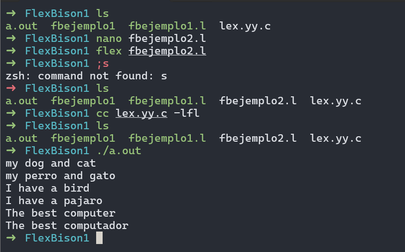
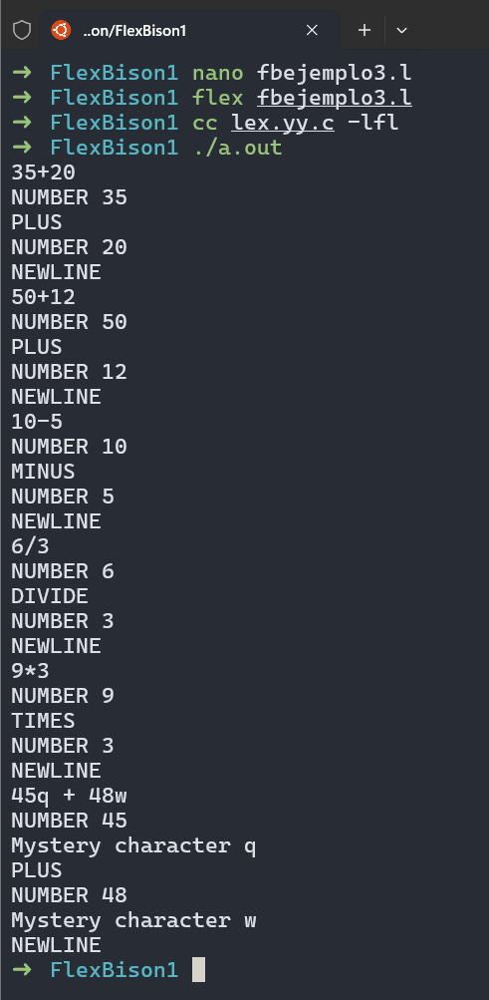
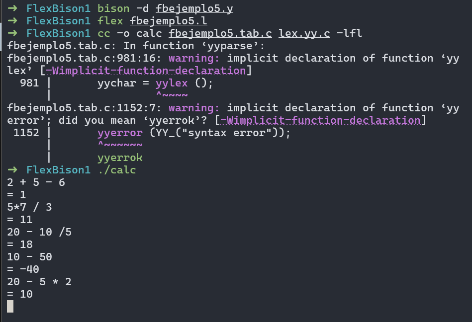

````md
# Flex and Bison – Capítulo 1 (Ejemplos y Ejercicios)

Repositorio con los ejemplos del Capítulo 1 del libro **Flex & Bison** y respuestas a los ejercicios.

## Requisitos

En Ubuntu:

```bash
sudo apt update
sudo apt install -y flex bison build-essential
````

## Estructura del proyecto

* `fbejemplo1.l` … `fbejemplo5.y`, `fbejemplo5.l`
* `fbejercicio2.y`, `fbejercicio2.l` (hex + comentarios)
* `fbejercicio3.y`, `fbejercicio3.l` (OR binario + abs())
* `images/` capturas de ejecución y/o imágenes del PDF

## Cómo compilar y ejecutar

### Ejemplos solo Flex (.l)

```bash
flex archivo.l
gcc -o prog lex.yy.c -lfl
./prog < input.txt
```

### Flex + Bison (.l + .y)

```bash
bison -d archivo.y
flex archivo.l
gcc -o calc archivo.tab.c lex.yy.c -lfl
./calc
```

---

## Índice

* [Ejemplo 1: contador de palabras](#ejemplo-1-contador-de-palabras)
* [Ejemplo 2: traductor simple](#ejemplo-2-traductor-simple)
* [Ejemplo 3: tokens de calculadora](#ejemplo-3-tokens-de-calculadora)
* [Ejemplo 4: scanner que retorna tokens + yylval](#ejemplo-4-scanner-que-retorna-tokens--yylval)
* [Ejemplo 5 y 6: calculadora con Bison + Flex](#ejemplo-5-y-6-calculadora-con-bison--flex)
* [Ejercicios](#ejercicios)

---

## Ejemplo 1: contador de palabras

Código: [`fbejemplo1.l`](fbejemplo1.l)


**Idea:** Flex divide el archivo en 3 secciones (definiciones, reglas, código C).
Las reglas cuentan:

* `[a-zA-Z]+` → incrementa palabras y suma caracteres usando `strlen(yytext)`
* `\n` → incrementa líneas y caracteres
* `.` → cuenta cualquier otro carácter

---

## Ejemplo 2: traductor simple

Código: [`fbejemplo2.l`](fbejemplo2.l)



**Idea:** Reemplaza palabras exactas (`"dog"`, `"cat"`, etc.) y deja el resto intacto con una regla catch-all (`.`).

---

## Ejemplo 3: tokens de calculadora

Código: [`fbejemplo3.l`](fbejemplo3.l)



**Idea:** Reconoce operadores y números e imprime el tipo de token.
Ignora espacios/tabs y reporta caracteres desconocidos.

---

## Ejemplo 4: scanner que retorna tokens + yylval

Código: [`fbejemplo4.l`](fbejemplo4.l)


**Idea:** En vez de imprimir, el scanner **retorna** tokens (ADD, NUMBER, etc.).
Para `NUMBER`, guarda el valor numérico en `yylval` para que el parser lo use después.

---

## Ejemplo 5 y 6: calculadora con Bison + Flex

Parser (Bison): [`fbejemplo5.y`](fbejemplo5.y)
Scanner (Flex): [`fbejemplo5.l`](fbejemplo5.l)



**Idea:**

* Bison define la gramática y evalúa expresiones usando `$$`, `$1`, `$2`, `$3`.
* Flex reconoce tokens y asigna `yylval` cuando encuentra números.
* `yyparse()` controla el flujo y llama a `yylex()` para pedir tokens.

---

# Ejercicios

## 1) Comentarios en una línea

**Respuesta:** la calculadora original no acepta comentarios porque el scanner no tiene regla para ignorarlos.
La solución más simple es en el scanner:

```lex
"//".* { /* ignore comment */ }
```

## 2) Hex + decimal

Se añadió reconocimiento de `0x...` con `strtol` y se imprime el resultado en decimal y hex.

## 3) OR binario y abs()

Para evitar ambigüedad usando `|` para dos cosas, se cambió el absoluto a `abs(exp)` y `|` quedó como OR binario.

## 4–6)

Respuestas y observaciones en esta sección.

```

---

## Ajustes a tu redacción (rápidos)
- Cambia “diccionario” por **reglas patrón→acción**
- Cambia “enter traduce” por “cuando el scanner reconoce el patrón…”
- En Ejemplo 3: aclara que `.` no incluye `\n` (por eso `\n` está separado)
- En ejercicios: corrige ortografía: *indentación*, *cómodo*, *estados*


